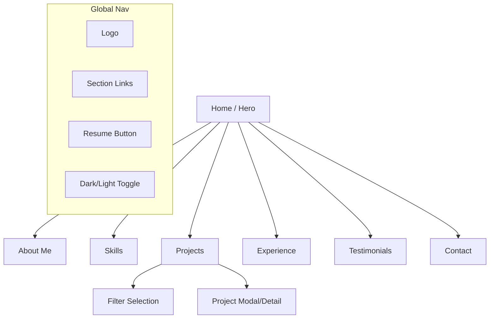

# UI/UX Specification: Personal Portfolio

**Version:** 1.0
**Date:** January 6, 2026
**Status:** Ready for Development

## 1. Design Philosophy
*   **Aesthetic:** "Modern Minimalist." Lots of whitespace, crisp typography, and subtle visual hierarchy.
*   **Interaction:** "Playful Professional." The content is serious, but the interactions (typing text, hover states, card lifts) add personality.
*   **Theme:** Dual-mode native. Design is defined by semantic tokens (e.g., `bg-primary`, `text-body`) rather than hardcoded hex codes to ensure smooth Dark Mode transitions.

## 2. Information Architecture (Site Map)
Single Page Application (SPA) structure with smooth scroll anchoring:

## 3. Visual Identity & System

### 3.1 Color Palette
*   **Primary Accent:** `#3B82F6` (Royal Blue) - Used for Buttons, Links, Active States.
*   **Neutral (Light Mode):**
    *   Background: `#FFFFFF`
    *   Surface/Cards: `#F3F4F6`
    *   Text Headings: `#111827`
    *   Text Body: `#4B5563`
*   **Neutral (Dark Mode):**
    *   Background: `#0F172A` (Slate 900) - *Not pure black for eye comfort*
    *   Surface/Cards: `#1E293B` (Slate 800)
    *   Text Headings: `#F9FAFB`
    *   Text Body: `#94A3B8`

### 3.2 Typography
*   **Font Family:** `Inter` or `Plus Jakarta Sans` (Google Fonts).
*   **Hierarchy:**
    *   H1 (Hero): 48px/64px (Mobile/Desktop), Bold.
    *   H2 (Section Titles): 32px, Semi-Bold.
    *   Body: 16px, Regular, 1.6 line-height for readability.

## 4. Key Component Specs

### 4.1 Navigation Bar
*   **Behavior:** Sticky on top. Backdrop blur (`backdrop-filter: blur(10px)`) background.
*   **Right Side:**
    *   Links (Hidden on Mobile, Hamburger Menu).
    *   **Dark Mode Toggle:** Sun/Moon icon. Simple click toggles `dark` class on `html` tag.
    *   **Resume Button:** Pill-shaped, Primary Accent background.

### 4.2 Hero Section with Typing Animation
*   **Layout:** Centered text content.
*   **Headline:** "Hi, I'm {Name}."
*   **Sub-headline:** "I am a " + `` element.
*   **Animation Behavior:** The `` text cycles through the `[Role]` list (e.g., "Developer", "Designer", "Creator") using a type/backspace effect.
*   **CTA:** Two buttons: "View My Work" (Primary) and "Contact Me" (Secondary/Outline).

### 4.3 Projects Grid & Filters
*   **Filter Bar:** Horizontal list of pills (e.g., "All", "React", "Design").
*   **State:** "Active" filter pill has Primary Background; others have Surface Background.
*   **Grid:** 1 column (Mobile) -> 2 columns (Tablet) -> 3 columns (Desktop).
*   **Card:**
    *   Thumbnail image (16:9 aspect ratio).
    *   Title + Short Description.
    *   Tech Stack Tags (Small pills at bottom).
    *   **Hover:** Card lifts slightly (`translate-y`), shadow increases.

### 4.4 Testimonial Slider
*   **Layout:** Single card centered.
*   **Controls:** Left/Right arrows and/or bottom dots.
*   **Auto-play:** Pauses on hover.
*   **Content:** Quote text, Author Name, Role/Company.

### 4.5 Contact Form
*   **Fields:** Name, Email, Message (Textarea).
*   **Validation:** Client-side (HTML5 required + Regex for email).
*   **Feedback:**
    *   Success: Replaces form with "Message Sent! Thanks for reaching out."
    *   Error: Inline red text message.

## 5. Responsiveness Strategy
*   **Breakpoints:**
    *   Mobile: < 640px
    *   Tablet: 640px - 1024px
    *   Desktop: > 1024px
*   **Mobile Adaptations:**
    *   Navbar collapses into Hamburger menu.
    *   Project grid becomes single column.
    *   Padding reduces from `px-12` to `px-4`.

***

